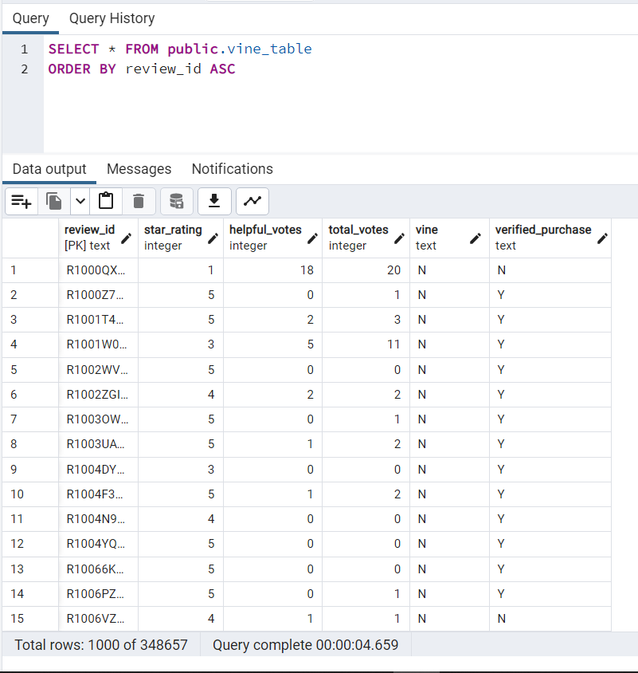
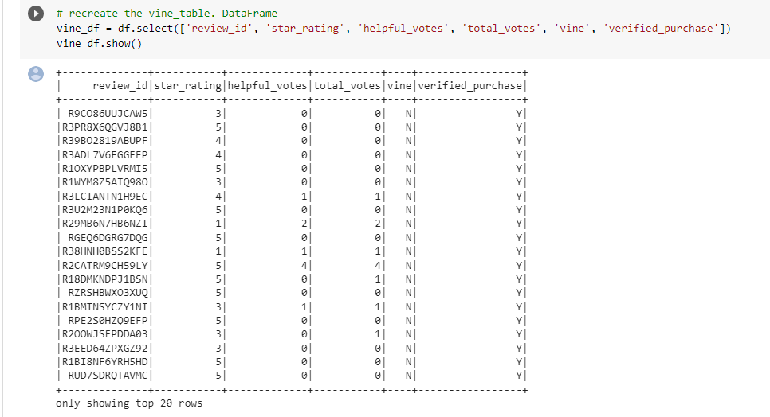
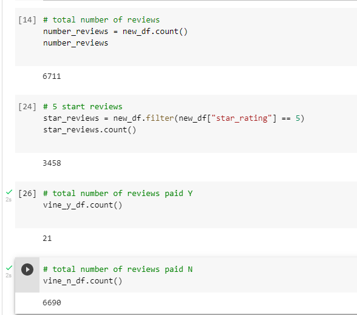
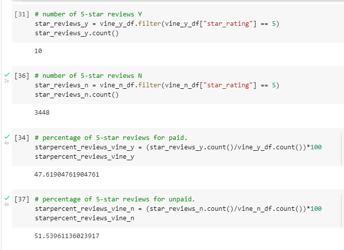

# Amazon_Vine_Analysis

## Overview of the analysis:

Using Google Colab,  ETL was performed using PySpark to extract, transform and load A database of Amazon review data for luggage into a four table database: customers_table, products_table, review_id_table, and vine_table. using AWS RSD service and pgAdmin. Review data from the Vine program was further analyzed to determine if there is any bias toward favorable reviews from Vine members in your dataset. For this, the vine_table was recreated outside of pgAdmin using Google Colab and pysSpark to avoid incurring in costs from the use the AWS RDS.

### Images

[ETL table from pgAdmin: vine_table](Capture_3_vine_table.PNG)

[Recreated vine_table](Capture_7_recreate_vine_table.PNG)

## Results: 

### Images

[Vine vs non-Vine reviews](Capture_5_vine_summary.PNG)

### Results  
•	How many Vine reviews and non-Vine reviews were there? There are 21 Vine reviews and 6690 non-vine reviews for a total of 6711 reviews. 

•	How many Vine reviews were 5 stars? There are 10 Vine 5 star reviews.

•	How many non-Vine reviews were 5 stars? There are 3448 non-Vine 5 star reviews.

•	What percentage of Vine reviews were 5 stars? 48% of Vine reviews are 5 stars.

•	What percentage of non-Vine reviews were 5 stars? 51% of non-Vive reviews are 5 stars. 

## Summary

The rate of 5 star reviews for both Vine and non-Vine reviewers is around 50%. This might indicate there is no positive bias in the Vine program. To support this conclusion, further statistical analysis i.e t-test,  is required to determine if there is statistical difference between both groups. 

